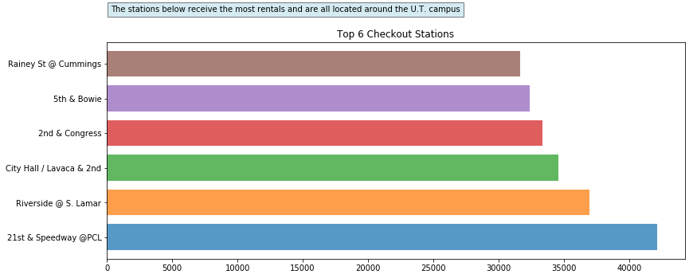
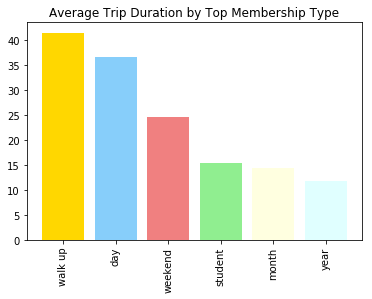

## Pedaling through Austin Project

### Team Members:

Tinku Supakar, Ananya Yetigadda, Jo Anne Thanner & Gabriela Cantu 

### Introduction: 

>“Austin B-cycle is public bike share system that rolled in to Austin in December 2013. The system is owned by the City of Austin and operated by the local 501c3 non-profit Bike Share of Austin. Austin B-cycle immediately broke national records for check outs during SXSW—making it one of the most successful bike-sharing programs in the country. Currently there are 76 B-cycle stations around downtown Austin”- Austin B-Cycle 

### Project Description:

We are independently analyzing the bike sharing data from the Austin B-Cycle company within a 5 year span (2013-Present). The analysis seeks to draw trends related to the demand of the service.
 
* The first part of the analysis will look at the demand by station, membership, year, month, and hour.
* The second part will rank stations and membership.
* The last part will look at the unique and temporary Austin population peeks such as SXSW and ACL for all 5 years, and Uber Ban for (May 9, 2016 - May 29, 2017).
 
### Purpose: 

This analysis suggests a more efficient allocation of resources in order to meet peak demand times and locations. The implications of this analysis could also help the program determine the low demand times to schedule maintenance and restocking.

### Scope: 

* We only have the data for the Austin B-Cycle company.
* Data is only from December, 2013 through July, 2018.

### Data Set: 

* [Austin B-Cycle bicycle sharing program API](https://data.austintexas.gov/resource/cwi3-ckqi.json)

### Research Questions : 

1. Is there any variation in the bike utilization over 5 years?

2. What are the high demand hubs and times that Austin B-Cycle needs to meet?

3. What have been the different categorical membership types and what is the utilization of the service by type of membership?

4. Is there a correlation between annual events and rides?

5. How long is a trip on an average?

6. Unique and Temporary Situations that affects the bike rides?

### Actions and Tasks: 

* Obtaining all the data from Austin B-Cycle Company
* Data Cleaning and Exploration
* Chart Plotting
* Writing Analysis

### Research Findings :

1. Is there any variation in the bike utilization over 5 years?

* Bike utilization have been increased from 2013 to 2015 and then it reached a plateau. However, in the current year, 2018, demand has exploded since the offering of free 18 month memberships to U.T. students.

2. What are the high demand hubs and times for B-Cycle?

- NOTE : Total ride count from 2013 to 2018 are taken into consideration
* Speedway & 21st by PCL has high number of checkouts 
* Months of March and October has high record of total  checkouts which correspond to SXSW and ACL 
* There is more usage of bikes on weekends compared to weekdays.Saturday is the busiest day of the week 
* 5pm is the peak time for bike ride on any day of the week

3.

4. Is there a correlation between annual events and rides?
- Note : Data from 2014 to 2017 is considered 

* Annual events like SXSW and ACL affects the bike utilization .The graph proves the point with high number of total checkouts in the month of March and October.

5. How long is a trip on an average?

- NOTE : Total ride count from 2013 to 2018 are taken into consideration

* Trips are usually on an average of 28 minutes , calcualting on total trip duration in the data

6. Unique and Temporary Situations that affects the bike rides?

Total bike rides during Uber Ban were higher except for 2018, which was affected by the U.T. students free bike rentals.

### Conclusions: 

* We found that bike usage increases consistently throughout the years and that March and October are the top two months with the most bike rentals. This is due to SXSW and ACL festivals.
* There is more usage of bikes on weekends compared to weekdays.
* Saturday has the most bicycle rentals and 2:00pm to 5:00 pm are the busiest hours on any day of the week. 
* The top station is 21st and Speedway.
* The most popular membership type is “walk up” with the longest average trip duration of 41 minutes.
* The 18 month U.T. pilot program for free student bike rentals started in 2018, and is very popular.
* Total bike rides during Uber Ban were higher except for 2018, which was affected by the U.T. students free bike rentals.
